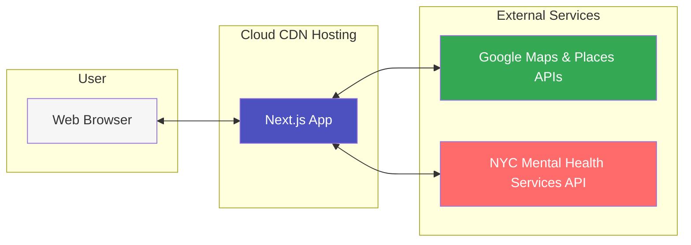

# Mental Health Service Finder

This project is a mental health service finder that uses the Google Places API to search for mental health services near a user's location. The user can enter a location and a search term to find mental health services near them. The user can also click on a service to view more details about the service.


## Cloud Architecture Diagram



## Getting Started

First, set your Google API key:

1. Create a `.env.local` file in the root of your project.
2. Add your Google API key to the file:
   ```
   NEXT_PUBLIC_GOOGLE_MAPS_API_KEY=your_google_api_key_here
   ```

Next, run the development server:

```bash
npm run dev
# or
yarn dev
# or
pnpm dev
# or
bun dev
```

Open [http://localhost:3000](http://localhost:3000) with your browser to see the result.

## Project Structure

```bash
app
├── components
│   ├── cards
│   │   └── service-result.tsx    # Component for displaying service results
│   ├── index.ts                  # Export all components
│   └── [shared-components].tsx   # Shared layout and functional component
├── layout.tsx                    # Main layout component
└── page.tsx                      # Main page component
```

## Future Improvements

Here are some potential future improvements to scale this application:

1. **Data Pipeline**: Develop a robust data pipeline to ingest, clean, validate, and enrich mental health service data:

   - Cleaning and standardizing data formats for consistent display.
   - Separating phone numbers with extension numbers into new fields for proper display.
   - Validating addresses to ensure accuracy.
   - Adding hours of operation and alternate phone numbers using the Google Places API.

2. **Proxying Requests and Caching**: Strategies can help improve performance and reliability:

   - **Implement a proxy server** to handle requests to external APIs. This can help manage rate limits, improve security, and provide a single point of access for external data.
   - **Caching mechanisms** to store frequently accessed data to reduce load on external APIs and improve the application's response times.

3. **Monitoring and Logging**: Implement monitoring and logging to track the application's performance and detect issues early. Create runbooks and playbooks, along with configured alerts and notifications to promptly inform engineers of issues for quick response and resolution.
