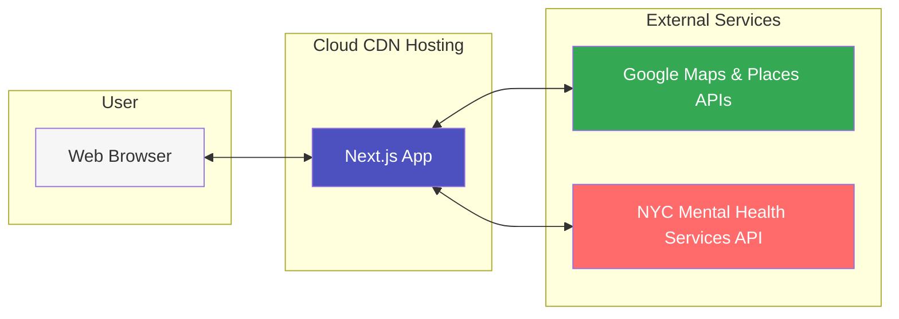

# Mental Health Service Finder

This project is a mental health service finder that uses the Google Places API to search for mental health services near a user's location. The user can enter a location and a search term to find mental health services near them. The user can also click on a service to view more details about the service.


## Cloud Architecture Diagram



## Getting Started

First, set your Google API key:

1. Create a `.env.local` file in the root of your project.
2. Add your Google API key to the file:
   ```
   NEXT_PUBLIC_GOOGLE_API_KEY=your_google_api_key_here
   ```

Next, run the development server:

```bash
npm run dev
# or
yarn dev
# or
pnpm dev
# or
bun dev
```

Open [http://localhost:3000](http://localhost:3000) with your browser to see the result.

You can start editing the page by modifying `app/page.tsx`. The page auto-updates as you edit the file.

This project uses [`next/font`](https://nextjs.org/docs/app/building-your-application/optimizing/fonts) to automatically optimize and load [Geist](https://vercel.com/font), a new font family for Vercel.

## Project Structure

```bash
app
├── components
│   ├── cards
│   │   └── service-result.tsx    # Component for displaying service results
│   ├── index.ts                  # Export all components
│   └── [shared-components].tsx   # Shared layout component
├── layout.tsx                    # Main layout component
└── page.tsx                      # Main page component
```

## Learn More

To learn more about Next.js, take a look at the following resources:

- [Next.js Documentation](https://nextjs.org/docs) - learn about Next.js features and API.
- [Learn Next.js](https://nextjs.org/learn) - an interactive Next.js tutorial.

You can check out [the Next.js GitHub repository](https://github.com/vercel/next.js) - your feedback and contributions are welcome!

## Deploy on Vercel

The easiest way to deploy your Next.js app is to use the [Vercel Platform](https://vercel.com/new?utm_medium=default-template&filter=next.js&utm_source=create-next-app&utm_campaign=create-next-app-readme) from the creators of Next.js.

Check out our [Next.js deployment documentation](https://nextjs.org/docs/app/building-your-application/deploying) for more details.
